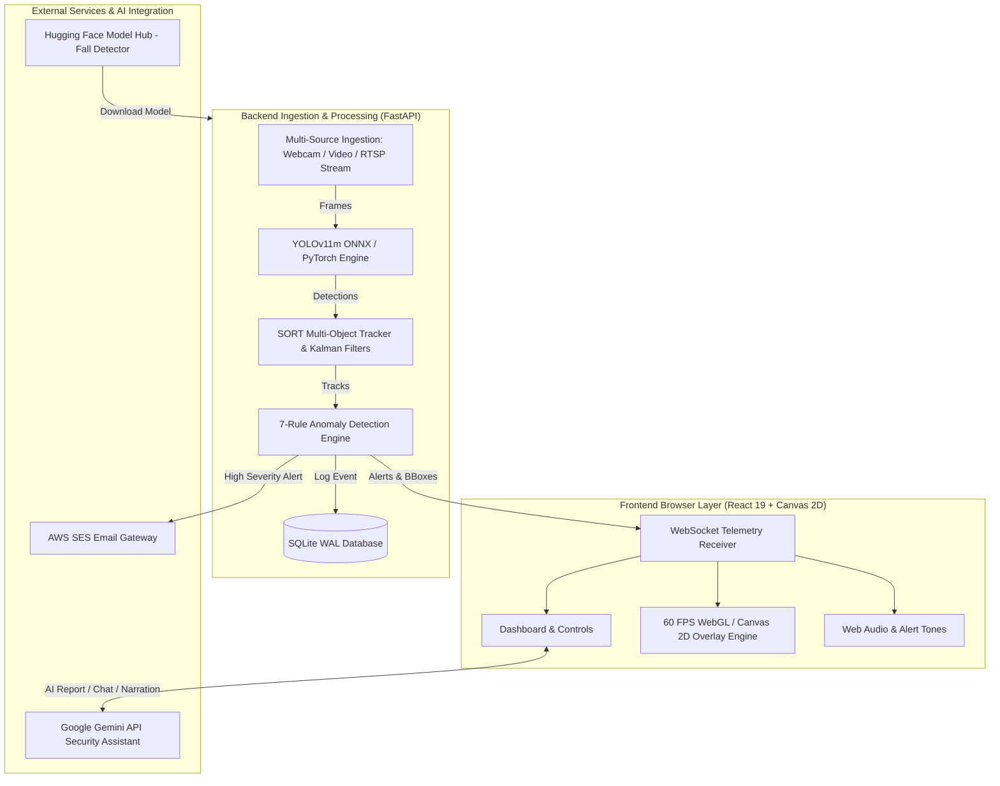

# 👁️ CrowdLens — Real-Time Campus AI Security & Surveillance Monitor

<div align="center">


**An Intelligent, Real-Time Surveillance & Behavioral Anomaly Engine Powered by YOLOv11m, SORT Tracking, and FastAPI**

[](https://python.org)
[](https://fastapi.tiangolo.com)
[](https://docs.ultralytics.com)
[](https://react.dev)
[](https://vitejs.dev)
[](https://onnxruntime.ai)
[](LICENSE)
[](CONTRIBUTING.md)

[Overview](#-overview) • [Key Features](#-key-features) • [Anomaly Algorithms](#-behavioural-anomaly-detection-suite) • [Architecture](#-system-architecture) • [Quick Start](#-quick-start) • [API Reference](#-api--websocket-reference) • [Documentation](#-research--documentation-suite)

</div>

---

> [!IMPORTANT]
> **CrowdLens** is an open-source, edge-ready security surveillance platform designed for educational institutions, campuses, and commercial properties. It turns standard RTSP camera feeds, webcams, or offline video files into automated threat detection nodes without relying on expensive proprietary software.

---

## 🌟 Overview

CrowdLens combines state-of-the-art vision models (**YOLOv11m**), multi-target Kalman tracking (**SORT**), and custom spatial-temporal behavioural heuristics to detect **7 critical safety anomalies** in real time:

- **Edge & Server Acceleration**: Runs via ONNX Runtime (CUDA GPU / OpenVINO / CPU) with dynamic resolution downscaling ($640\times 360$) cutting inference latency by $\sim 75\%$.
- **Multi-Source Ingestion**: Ingests browser webcams (`getUserMedia`), uploaded MP4/MKV video files, RTSP IP camera streams (FFmpeg pipe), and local network MJPEG feeds.
- **Live 60 FPS HUD**: WebGL/Canvas 2D dashboard featuring 5 customizable tactical overlay modes (*Cyberpunk, Tactical HUD, Minimal Clean, High Contrast, Thermal Matrix*).
- **Automated Incident Escalation**: Dispatches Web Audio alerts, browser push notifications, AWS SES HTML evidence emails, and logs snapshots to SQLite with 7-day retention.
- **AI Security Copilot**: Integrated with Google Gemini API for incident summaries, interactive alert chat, and live camera scene narration.

---

## 🛠️ Tech Stack

| Layer | Technologies & Tools |
| :--- | :--- |
| **Vision & ML Inference** | YOLOv11m (Ultralytics), ONNX Runtime, HuggingFace Fall Model (`melihuzunoglu/human-fall-detection`), OpenCV |
| **Tracking Engine** | SORT (Kalman Filtering + Hungarian Linear Assignment algorithm) |
| **Backend API** | Python 3.11, FastAPI, Uvicorn, WebSockets, Asyncio, SQLite (WAL mode) |
| **Frontend UI** | React 19, Vite 7, TailwindCSS v4, Canvas 2D, Lucide Icons, shadcn/ui |
| **Streaming Pipeline** | FFmpeg (RTSP / HTTP stream piping), Binary & JSON WebSocket frames |
| **Notifications & AI** | AWS SES Email Gateway, Web Audio API, Web Notifications API, Google Gemini API |

---

## 🚨 Behavioural Anomaly Detection Suite

CrowdLens runs 7 specialized spatial-temporal detection algorithms concurrently over tracked entity trajectories:

| Anomaly Type | Detection Method & Heuristics | Status | Threshold Defaults |
| :--- | :--- | :---: | :--- |
| 🏃 **Running** | Dual-metric: Body-heights/sec ($\ge 1.6\text{ h/s}$) + absolute velocity floor ($\ge 60\text{ px/s}$) with $0.4\text{s}$ grace period against frame jitter. | ✅ Production | $270\text{ px/s}$ / $1.6\text{ h/s}$ |
| 🧳 **Unattended Object** | Identifies stationary baggage ($\le 130\text{ px}$ movement over 12 frames), assigns nearest owner ($180\text{ px}$). Triggers when owner/bystander is absent $> 5.0\text{s}$. Includes spatial ghost cache ($96\text{ px}$ cell, $8\text{s}$ TTL) to survive SORT ID churn. | ✅ Production | $5.0\text{s}$ abandonment |
| 🤸 **Fall Detection** | HuggingFace YOLO fall detector + pose aspect ratio filter (upright-to-horizontal transition) + person IoU association ($\ge 0.20$) + ground texture rejection. | ✅ Production | $2.5\text{s}$ persistence |
| 👥 **Overcrowding** | Single-link spatial clustering within $200\text{ px}$. Calculates density per $1000\text{ px}^2$ and triggers on high cluster density ($\ge 4$ persons). | ✅ Production | $\ge 4$ persons / cluster |
| 🚫 **Restricted Zone** | Evaluates polygon or rectangular digital fences. Checks if person center, foot point, or bbox overlap enters restricted coordinates with dwell time $\ge 0.6\text{s}$. | ✅ Production | $0.6\text{s}$ dwell time |
| 🥊 **Fight Suspected** | Monitors person pairs in close proximity ($\le 180\text{ px}$) moving at mutual high velocity ($\ge 240\text{ px/s}$) over persistent frames ($0.8\text{s}$). | 🔬 Prototype | $0.8\text{s}$ pair speed |
| 🚶 **Loitering** | Evaluates continuous dwell time ($\ge 15.0\text{s}$) within an anchor radius ($180\text{ px}$) using a $1.5\times$ hysteresis band to prevent perimeter flickering. | ✅ Production | $15.0\text{s}$ dwell radius |

---

## 📐 System Architecture



---

## ⚡ Quick Start

### Prerequisites

- **Python**: 3.11 or higher (`uv` recommended for 10x faster package installation)
- **Node.js**: 24+ with `pnpm`
- **FFmpeg**: Installed and added to system `PATH` (required for RTSP/IP camera streaming)
- **Git**

---

### Installation & Setup

1. **Clone the Repository**
   ```bash
   git clone https://github.com/NikhilGupta777/CrowdLens.git
   cd CrowdLens
   ```

2. **Backend Setup (Python & Dependencies)**
   ```bash
   # Install uv (fast Python package installer)
   pip install uv

   # Create environment & sync dependencies
   uv sync
   ```

3. **Frontend Setup (Node.js & pnpm)**
   ```bash
   # Install frontend dependencies
   pnpm install
   ```

4. **Environment Configuration**
   Copy the example environment template:
   ```bash
   cp .env.example .env
   ```
   *Edit `.env` to configure Gemini API keys or AWS SES email alert credentials.*

---

### Running the Application

#### 🚀 Option A: One-Click Windows Start
Double-click [`start.bat`](start.bat) in the project root. It automatically initializes the backend server, launches the Vite development server, and opens your browser.

#### 🛠️ Option B: Manual Two-Terminal Launch

**Terminal 1 — Backend (FastAPI Server on Port 8080):**
```bash
uv run uvicorn backend.main:app --host 127.0.0.1 --port 8080 --reload
```

**Terminal 2 — Frontend (Vite Server on Port 5173):**
```bash
cd artifacts/company-ai
pnpm run dev
```

Open **`http://localhost:5173`** in your browser.

---

## ⚙️ Environment Variables Reference

| Key | Description | Default / Example |
| :--- | :--- | :--- |
| `AI_INTEGRATIONS_GEMINI_API_KEY` | Google Gemini API key for AI assistant features | `AIzaSy...` |
| `AI_INTEGRATIONS_GEMINI_BASE_URL` | Base URL for Gemini LLM requests | `https://generativelanguage.googleapis.com/v1beta` |
| `ALERT_EMAIL_TO` | Recipient email address for security alert dispatches | `security@campus.edu` |
| `ALERT_EMAIL_FROM` | AWS SES verified sender email | `alerts@campus.edu` |
| `ALERT_EMAIL_COOLDOWN_SECS` | Cooldown period between consecutive email dispatches | `45` |
| `ALLOW_LOCAL_STREAMS` | Flag to enable campus IP camera / RTSP streaming | `true` |
| `FALL_MODEL_LOCAL_PATH` | Optional local override path for `.pt` fall detector weights | `""` |

---

## 📡 API & WebSocket Reference

### REST API Endpoints

| Method | Endpoint | Description |
| :--- | :--- | :--- |
| `GET` | `/api/health` | Service health check and uptime diagnostic |
| `GET` | `/api/stats` | Real-time scene telemetry (person count, FPS, active tracks) |
| `GET` | `/api/alerts/history` | Paginated alert log history with filter & search support |
| `GET` / `PUT` | `/api/config` | Live threshold reader and hot-reloading update endpoint |
| `POST` | `/api/video/upload` | Ingest MP4/AVI/MKV video files (up to 500 MB) |
| `POST` | `/api/stream/start` | Initialize RTSP / HTTP IP camera stream reader |
| `POST` | `/api/gemini/report` | Generate AI incident summary via Google Gemini |
| `POST` | `/api/gemini/narrate` | Generate live camera scene text description |

### WebSocket Channels

| Route | Payload Type | Description |
| :--- | :--- | :--- |
| `ws://localhost:8080/ws` | JSON | Real-time telemetry broadcast (bounding boxes, track IDs, active alerts, FPS) |
| `ws://localhost:8080/ws/cam` | Binary / Base64 | Low-latency browser webcam frame ingestion stream |

---

## 📊 Hardware Benchmarks & Performance

Tested across standard desktop and server hardware configurations ($640\times 360$ inference):

| Hardware Profile | Backend Engine | Inference Speed | Latency | Max Feeds |
| :--- | :--- | :---: | :---: | :---: |
| Intel Core i7-12700K (CPU only) | ONNX Runtime (CPU) | 12 - 18 FPS | ~180 ms | 2 Concurrent |
| NVIDIA RTX 3060 (12 GB VRAM) | ONNX Runtime (CUDA) | 45 - 60 FPS | ~35 ms | 8 Concurrent |
| NVIDIA RTX 4090 (24 GB VRAM) | ONNX Runtime (TensorRT) | 120+ FPS | ~12 ms | 20+ Concurrent |

---

## 📚 Research & Documentation Suite

Comprehensive technical, architectural, and research publications are indexed in the [`docs/`](docs/) folder:

- 📄 [`01_FULL_PROJECT_REPORT.md`](docs/01_FULL_PROJECT_REPORT.md) — Complete 30-page engineering architecture report.
- 📐 [`02_ARCHITECTURE_DOCUMENT.md`](docs/02_ARCHITECTURE_DOCUMENT.md) — Detailed software design specification & data pipeline.
- 📊 [`03_PPT_CONTENT.md`](docs/03_PPT_CONTENT.md) — Presentation deck slides & architecture script.
- 📜 [`04_JOURNAL_PAPER_CONTENT.md`](docs/04_JOURNAL_PAPER_CONTENT.md) — IEEE format academic journal paper draft.
- 🧩 [`05_FEATURE_LIST_AND_MODULES.md`](docs/05_FEATURE_LIST_AND_MODULES.md) — Feature breakdown & module mapping.
- 🔮 [`06_FUTURE_SCOPE_AND_FIGHT_DETECTION.md`](docs/06_FUTURE_SCOPE_AND_FIGHT_DETECTION.md) — Roadmap & ML fight detection research.

---

## 🤝 Contributing

Contributions are welcome! Please follow these steps:
1. Fork the repo (`https://github.com/NikhilGupta777/CrowdLens`)
2. Create your feature branch (`git checkout -b feature/AmazingFeature`)
3. Commit your changes (`git commit -m 'Add some AmazingFeature'`)
4. Push to the branch (`git push origin feature/AmazingFeature`)
5. Open a Pull Request

---

## 📜 License

Distributed under the MIT License. See [`LICENSE`](LICENSE) for details.

---

<div align="center">

**Built with ❤️ for Campus & Institutional Safety**

</div>
